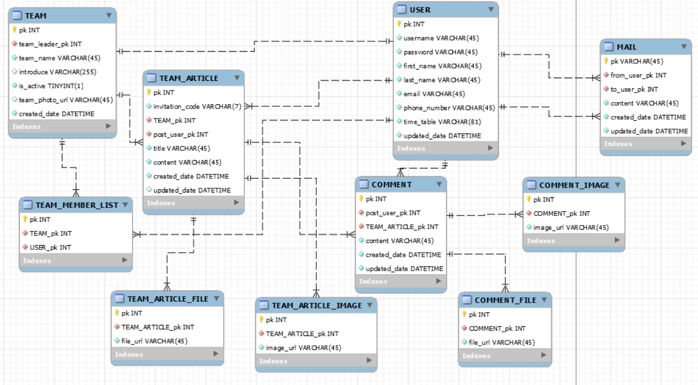

# TeamPle

U임승차(팀플에서 필요한 관리를 한번에!)

## 프로젝트 기본 설정

```bash
pip3 install -r requirements.txt
```

윈도우는 pip3를 pip로 바꿔서 필요한 패키지들을 설치해주세요.

## 모델 설계



## 개발 체크리스트

### 현수

- [x] 회원가입 구현(AbstractBaseUser)
- [ ] 로그인, 회원가입 구현
- [ ] 시간표는 2진데이터로 구현 시간표 끼리 비교는 views.py에서 구현
- [ ] 시간표 표시는 자바스크립트로 표형식으로 규현
- [ ] 랜덤함수로 아스키코드 구현(0~9, A~Z 총 6자리)
- [ ] 초대코드로 팀에 들어가는 방식 구현

### 수현

- [ ] 프론트엔드 구성(부모 템플릿, 팀)
- [ ] 팀 생성, 팀원 추가 기능 구현

### 해철

- [ ] 프론트엔드 구상하고 그거에 맞춰서 기능 구현
- [ ] 받는 사람 어떻게 추가할지 구상

### 태현

- [ ] 파일, 이미지 여러개 추가하는 방식 구현
- [ ] 팀 글, 댓글 구현

## 팁

- 마이그레이션 오류

```bash
find . -path "*/migrations/*.py" -not -name "__init__.py" -delete
find . -path "*/migrations/*.pyc"  -delete
python manage.py makemigrations
python manage.py migrate
```

마이그레이션 파일들(__init__.py 제외)을 삭제하고 다시 마이그레이션한다.

- manage.py 관련 오류

```bash
pip3 uninstall django
pip3 install django==2.2.3
```
